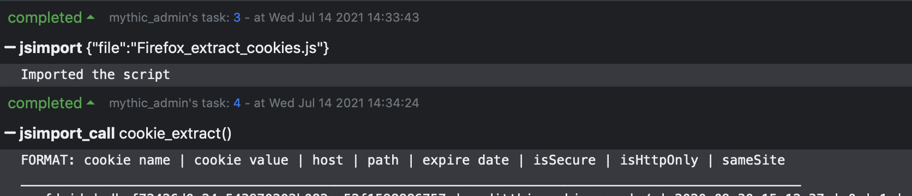

# JXA-Firefox
JXA Scripts for extracting data from Firefox

This repo contains two JXA (JavaScript for Automation) scripts for extracting info from Firefox on macOS. Scripts:

1. Firefox_extract_cookies.js: Reads cookie and expiry date info from the cookies.sqlite database file. Output is presented in the following format:

**cookie name | cookie value | host | path | expire date | isSecure | isHttpOnly | sameSite**

2. Firefox_extract_history.js: Reads url and visit date info from the places.sqlite database file. Output is presented in the following format:

**Date | URL**

## Using With Mythic C2

> jsimport Firefox_extract_cookies.js (or jsimport Firefox_extract_history.js)

> jsimport_call cookie_extract() (or jsimport_call history_extract())

Results will be returned in Mythic console
